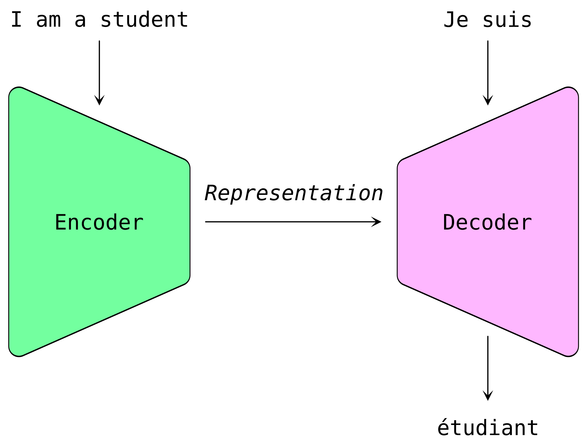
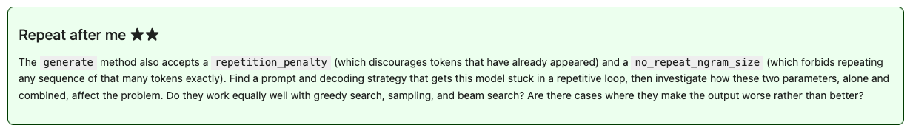

## ChatGPT {.hidden-title}

::: {.chatgpt-demo}

ChatGPT

conversational harness

General Purpose Transformer

:::

---

## Encoder-decoder architecture for machine translation

---

## Encoder-decorder (_sequence-to-sequence_) models are useful for
* translation

. . .

* grammar correction
* summarisation
* question answering
* structured data interpretation

::: aside
Notable models of this sort include BART (Facebook, 2019) and T5 (Google, 2020).
:::

---

## Encoder-only (_autoencoding_) models are useful for

. . .

* text classification
* named entity recognition
* semantic embedding 
    * search 
    * clustering
    * image generation

::: aside
The best-known model of this sort is BERT (Google, 2018). Successors include RoBERTa, DeBERTa and DistilBERT.
:::

---

## Decoder-only (_autoregressive_) models are useful for

. . .

* open-ended text generation
* code generation
* chatbots and conversational agents
* few-shot learning tasks
* …most other tasks!

::: aside
Most frontier LLMs, including GPT, Llama, Mistral, and Gemma, are of this type.
:::

# About this module

## Topics
In the first semester, we will focus on the [*transformer*]{.mark-from-fragment} and *diffuser* architectures. We will study topics including

:::{.incremental}
* **tokenisation** and **sampling**: how to get text into and out of a model
* **causal** and **masked** language modelling: different tasks 
* **attention**: the magic that makes transformers so effective
* methods for **fine-tuning** models for particular applications or requirements
:::

## Topics
In the first semester, we will focus on the *transformer* and [*diffuser*]{.mark-from-fragment} architectures. We will study topics including

:::{.incremental}
* **autoencoders** to develop representations (embeddings) of data
* **conditional** and **latent** diffusion to generate images and other non-text data
* **text-to-image** and **image-to-image** models
:::

. . .

In the second semester, you will continue to a range of further applications including audio generation, coding and agentic AI.

## Assessment

### Code portfolio (60%)

Throughout the labs you'll see exercises marked with between one and three stars.

Each star is roughly intended to represent a day’s work.

Across the module, you should accumulate the best **ten stars’** worth of material for your portfolio.

## Assessment

### Code portfolio (60%)

You should:

* *Attempt* many more than 10 stars’ worth, so that you present your very best work to be marked (and to prospective future employers).
* Develop your work on your Github (and [fill in the form on QM+]{.mark} so I know where that is).
* Contribute to your portfolio regularly through the year.
* Present your solutions as an appropriate mixture of code and English text.
* Be prepared to defend your solutions at interview at the end of the year.

## Assessment

### Business coding challenge (40%)

This will take place across three intensive weeks in semester B.

You will work in groups to develop a generative AI solution to a particular business problem.

# Infrastructure

## Hugging Face 🤗

[Hugging Face](https://huggingface.co) is a repository of *open-weight* machine learning models, currently hosting over 2 million models and 1.5 million data sets.

Among many other features, it provides a series of Python libraries that present a uniform interface to different models, allowing us to easily compare them.
The API allows us to use a high-level `Pipeline` or investigate finer details, depending on our requirements.

## JupyterHub

Like last year, we’ll be running labs on a JupyterHub server, [hub.comp-teach.qmul.ac.uk](https://hub.comp-teach.qmul.ac.uk/).
Make sure to select the Applied AI Year 2 setup. 

You are also welcome to run on your own hardware. Most of the labs can be run on a CPU, although they will be noticably faster if you have a GPU available.

. . .

I have provided the models we’ll use in this module’s labs locally; trying to use them on the teaching server should automatically load the cached version.

If you try to load a model that is *not* locally available, it will simply download at the first attempt.

:::{.callout-warning}
You only have 10 GB of space in your account, which is enough for smallish models and data sets. If you find you are running out of space, look in `.cache/huggingface/hub` and check for data you’re no longer using.
:::