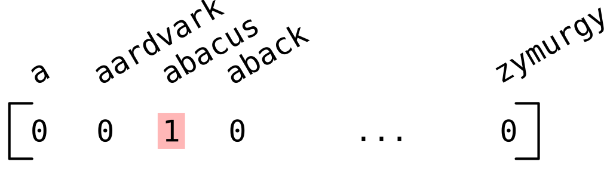
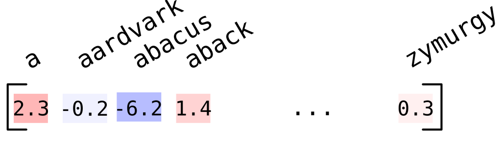

## Tokenisation

We interpret text input as a series of *tokens*. 

These will use a *one-hot* representation: that is, each token is represented by a vector that has value 1 in the position corresponding to a particular token and 0 everywhere else. 



Each vector will therefore have length equal to our total vocabulary size.

## Tokenisation

Each language model will have a different vocabulary and therefore a different approach to tokenisation.

:::{.incremental}
* Letters are probably too small: not enough meaning is conveyed within each, so the model has to combine many tokens to represent any concept.
* Words are probably too big: English dictionaries might have up to 300,000 distinct words!
* We can have an `UNKNOWN` token but only want to use this as a last resort.
:::

## Tokenisation

Let's see how this looks for a small model in the `Qwen` series.

```{python}
#| echo: true
#| output-location: fragment

from transformers import AutoTokenizer
tokenizer = AutoTokenizer.from_pretrained("Qwen/Qwen2-0.5B")

prompt = "Once upon a"
input_ids = tokenizer(prompt).input_ids
input_ids
```

. . .

Our three words turn into three tokens.

. . .

```{python}
#| echo: true
for t in input_ids:
    print(f"{t:5d} --> {tokenizer.decode(t)}")
```

. . .

Note that the space is included in the subsequent token: *e.g.*, token number 264 apparently represents `" a"`.

## Tokenisation

```{python}
#| echo: true
prompt = "DNA stands for deoxyribonucleic acid."
input_ids = tokenizer(prompt).input_ids
for t in input_ids:
    print(f"{t:5d} --> {tokenizer.decode(t)}")
```

. . .

Here the long word `deoxyribonucleic` is broken up into smaller tokens. Some (`" de"`, `"oxy"`) correspond to the semantic division of the English word, while others (`"ucle"`) do not.

Interestingly, `"DNA"` is apparently common enough to be a token in its own right.

---

## Output

The output will be a vector of *logits*, a score for each possible token:



```{python}
#| echo: true
from transformers import AutoModelForCausalLM
from torch import no_grad

model = AutoModelForCausalLM.from_pretrained("Qwen/Qwen2-0.5B")

prompt = "Once upon a"
input_ids = tokenizer(prompt, return_tensors="pt").input_ids
with no_grad():
    outputs = model(input_ids)

outputs.logits
```

## Output

This is more interpretable as a probability. We can make this conversion using the `softmax` function:

```{python}
#| echo: true
final_logits = outputs.logits[0,-1]
final_logits.softmax(dim=0)
```

. . .

We can find the most likely continuation using `argmax`:

```{python}
#| echo: true
#| output-location: fragment
predicted_logit = final_logits.argmax()  
tokenizer.decode(predicted_logit)
```

. . .

`Qwen` thinks that this is overwhelmingly likely to be the next token, with probability

```{python}
#| echo: true
final_logits.softmax(dim=0)[predicted_logit]
```

::: aside
Recall that $\text{softmax}(\mathbf{z})_i = \frac{\exp(z_i)}{\sum_i\exp(z_i)}.$ These values must therefore be positive and sum to 1.
:::