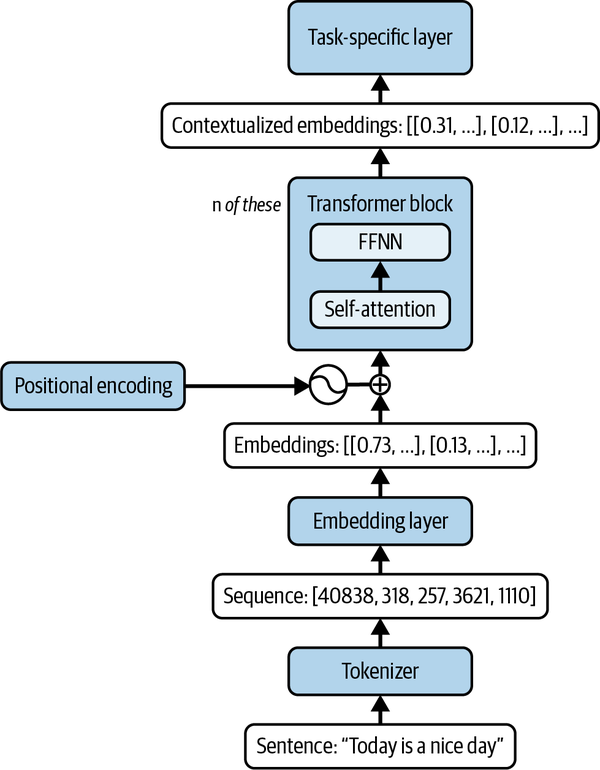
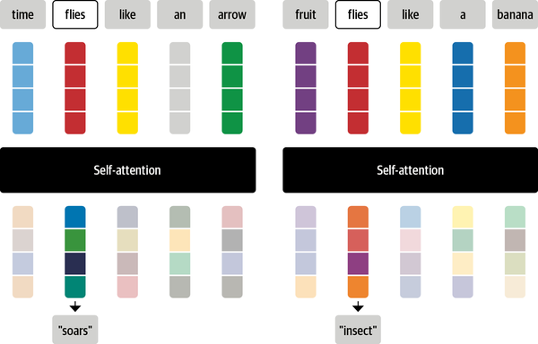

## The story so far

Recall the three architecture families from last week:

* **Decoder-only**: at each position, only the tokens *before* it are visible. Good for generating text left-to-right.
* **Encoder-only**: the *whole* sequence is visible at once, in both directions. Good for understanding a fixed piece of text.
* **Encoder-decoder**: an encoder sees the whole input; a decoder generates output while attending back to it.


## Masked language modelling

Encoder-only models like BERT are trained by hiding a token and predicting it from context on *both* sides.

```{python}
#| echo: true
#| output-location: fragment
from transformers import pipeline

fill_mask = pipeline("fill-mask", model="distilbert-base-uncased", top_k=2)
fill_mask("Paris is the [MASK] of France.")
```

. . .

Because the model can use words *after* the gap as well as before it, this task is called **masked language modelling (MLM)**.

## Causal language modelling

Decoder-only models like `Qwen` — the ones we used last lecture — only ever see what comes *before* the position they're predicting.

```{python}
#| echo: true
#| output-location: fragment
generator = pipeline("text-generation", model="Qwen/Qwen2-0.5B")
generator("Paris is the capital of", max_new_tokens=5)
```

. . .

This is **causal language modelling (CLM)**, the context in which we discussed greedy search, sampling, and beam search last week.

::: aside
"Causal" here just means "no peeking at the future" — nothing to do with cause and effect.
:::

## Looking deeper into the encoder

:::: {.columns}

:::{.column width="40%"}



:::

:::{.column width="60%" .incremental}
* We have already looked at the *tokeniser*, which transforms the input text into a series of one-hot encoded tokens.
* The next step is to transform these into *embeddings*, internal representations of the meaning of the input. (These will have a different dimension and no longer be one-hot encoded.)
* The *transformer* block applies something called *self-attention* to generate *contextualised embeddings*. What is going on here?

:::

::::

## Self-attention

Self-attention in the encoder allows ambiguous words to be embedded differently depending on their context:



## Self-attention

Other common examples include pronouns: 

`The chicken didn’t cross the road because it was too tired.`

. . .

Here *it* means *chicken* and definitely not *road*.


## Multi-head attention

A single attention computation only learns one way of relating tokens. **Multi-head** attention runs several of these in parallel.

* One head might specialise in tracking grammatical structure (which verb goes with which subject).
* Another might specialise in coreference (which pronoun refers to which noun).
* The model isn't told what each head should specialise in: this division of labour emerges from training.
* In practice, the roles of different heads are often less interpretable than these examples.


