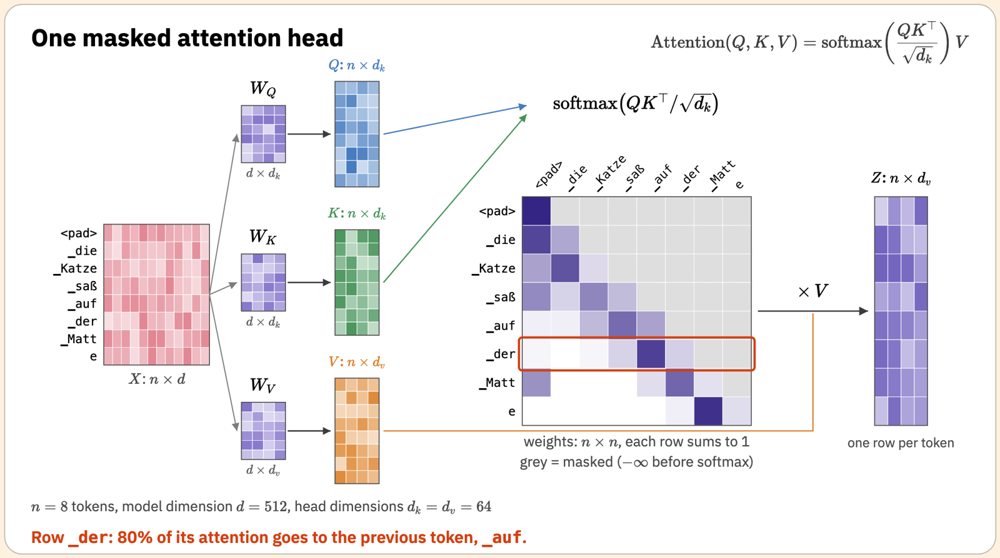
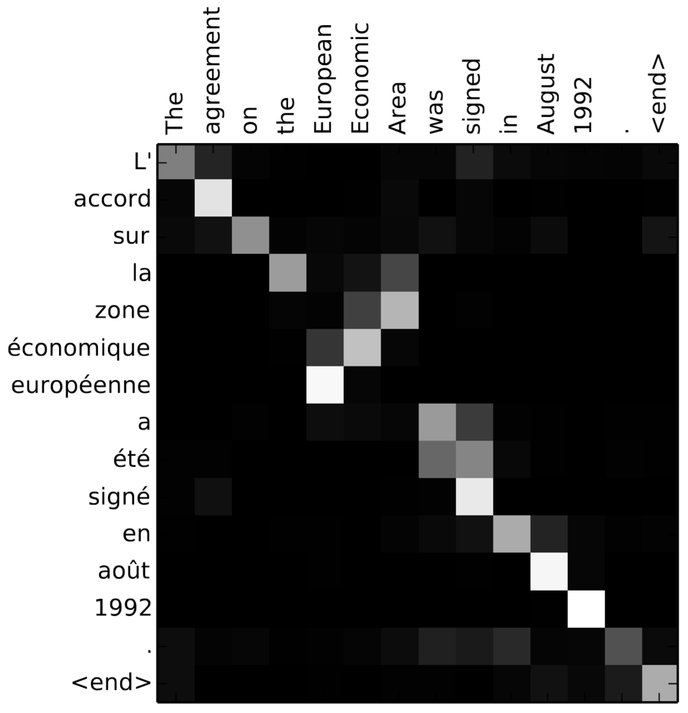
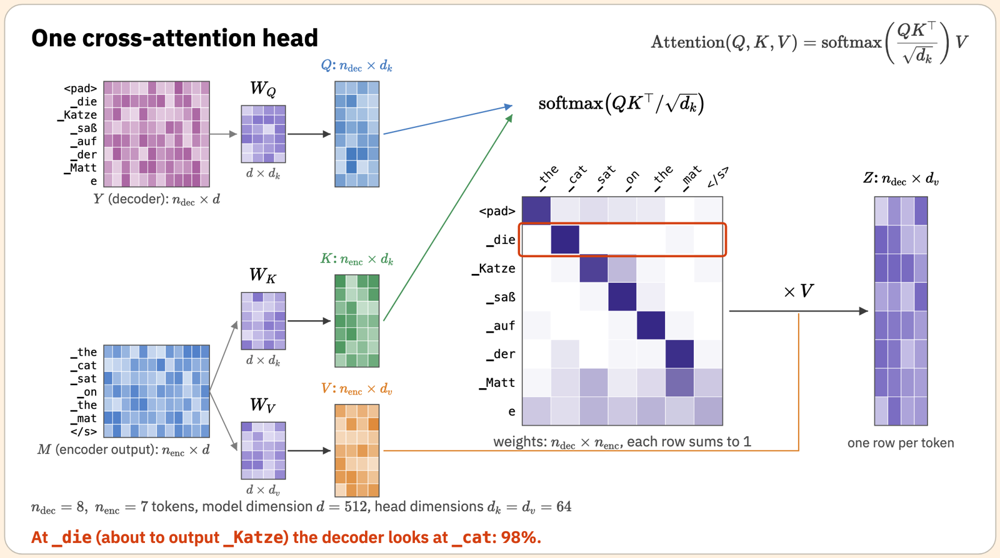
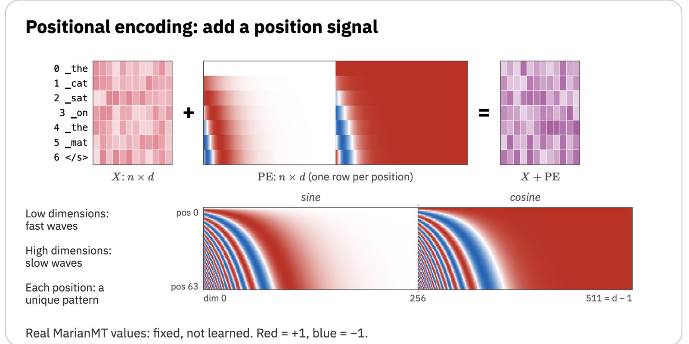
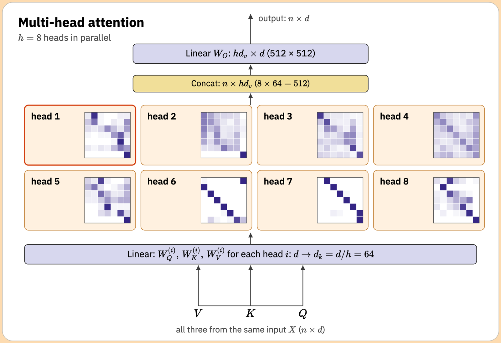
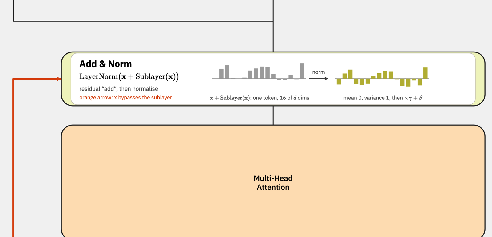
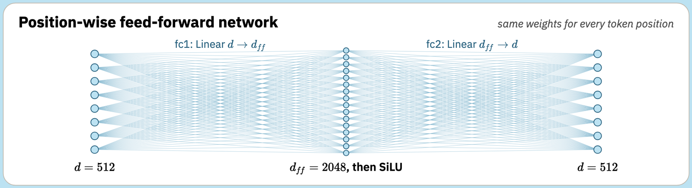
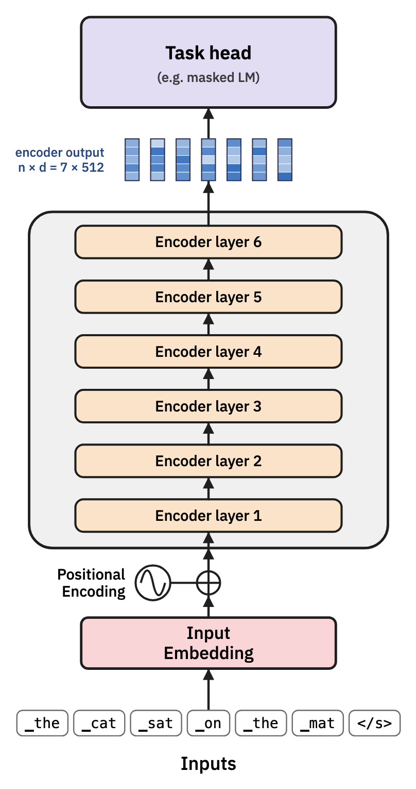
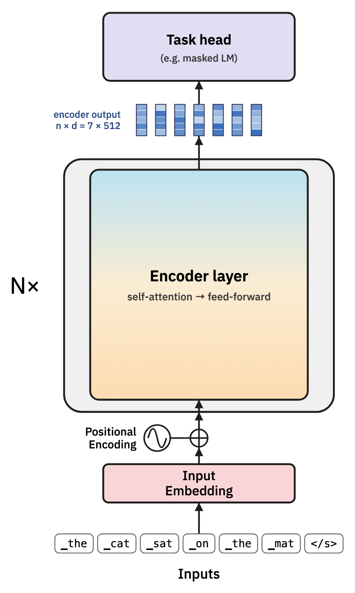
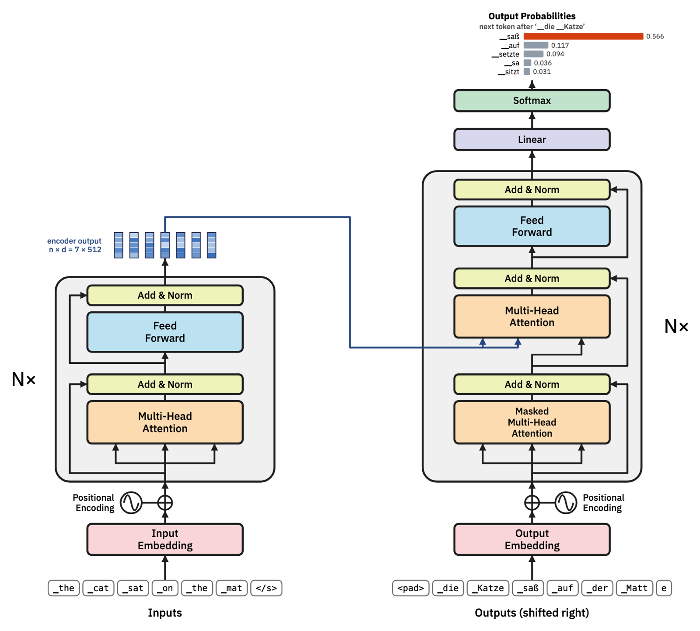

## Last time: attention

$$\text{Attention}(Q,K,V) = \text{softmax}\!\left(\frac{QK^\top}{\sqrt{d_k}}\right)V$$

## Today: the full original Transformer model architecture


## What we still need

The original Transformer is a sequence-to-sequence (encoder-decoder) model. 

To get from one attention head (last time) to the full model, we still need four ingredients.

:::{.incremental}
* **The decoder needs to pay attention to the encoder.** This is called *cross-attention*, as opposed to the *self-attention* we studied last time.
* **Attention can't see word order.** Nothing in the formula depends on where a token is in the sentence.
* **One head isn't enough.** A single attention step gives each token one query, and one blend of values. But a token often needs several different things from its context at once.
* **Attention isn't a complete model.** It needs to be packaged into a block that can be stacked many times, with an input and an output at either end.
:::

# Three variations on the theme of attention

## Self-attention (encoder)


## Masked self-attention (decoder)

* The decoder's input is the target sentence **shifted right**: it starts with a start token, so position $i$ predicts token $i+1$.
* During training, the whole target is fed in at once, and every position is predicted in parallel.
* With the whole target present, position $i$ could simply copy token $i+1$.

## Masked self-attention (decoder)



* We solve this the scores above the diagonal to $-\infty$ before the softmax, so their weights become 0. Each position sees only itself and earlier positions, just as in generation, where later tokens don't exist yet.

## Cross-attention (encoder-decoder)


* We have already seen that within the encoder, we modify the embedding of each input token by allowing it to pay attention to others in the input.
* Similarly, within the decoder, we can modify the embedding of each *output* token by allowing it to pay attention to others that have already been output.
* The final step is to allow the *output* to pay attention to the *input* tokens: this is *cross-attention*.

. . .

* The *query* comes from the *decoder*, but the *key* and *value* come from the *encoder*.


## Cross-attention 



## Cross-attention




# Ordering tokens

## Attention has no sense of order

:::{.incremental}
* Each score is a dot product of one token's query with another token's key. Neither depends on *where* those tokens are.
* Attention treats its input as an unordered *set* of tokens.
* But language obviously cares about order: "dog bites man" ≠ "man bites dog".
* Recall the "nearest noun" shortcut from the agreement example in the lab. Our keys couldn't express it, because they carried no information about position.
:::

## Positional encoding

The solution is to add a vector to each token's embedding that depends only on its *position* in the sequence.

$$X \;\to\; X + \text{PE}$$

:::{.incremental}
* PE is another $n \times d$ matrix: row $i$ is the encoding of position $i$, whatever token happens to be there.
* Now the same word at a different position has a different input vector, so it can have a different query, key and value.
* With position available, a head can learn queries like "the previous word" or "the nearest noun".
* What should the position vectors be? The original transformer paper used a fixed pattern of sine waves.
:::

## Sinusoidal positional encoding

```{python}
#| fig-width: 10
#| fig-height: 4.2
import matplotlib.pyplot as plt
from numpy import pi, linspace, sin, arange

plt.rcParams.update({"font.family": ["Helvetica Neue", "Helvetica", "DejaVu Sans"],
                     "font.size": 13, "axes.spines.top": False, "axes.spines.right": False})
RED, BLUE, GREY = "#b8352a", "#2c6fb7", "#999999"

d_model = 512
pos = linspace(0, 40, 801)
fig, axes = plt.subplots(4, 1, sharex=True, figsize=(10, 4.2))
for ax, dim in zip(axes, [0, 32, 64, 128]):
    wavelength = 2 * pi * 10000 ** (dim / d_model)
    ax.plot(pos, sin(pos * 2 * pi / wavelength), color=RED, lw=2)
    ints = arange(0, 41)
    ax.plot(ints, sin(ints * 2 * pi / wavelength), "o", color=RED, ms=3.5)
    ax.axvline(5, color=GREY, lw=1.5, ls="--")
    ax.set_ylim(-1.3, 1.3); ax.set_yticks([])
    ax.set_ylabel(f"dim {dim}", rotation=0, ha="right", va="center")
axes[-1].set_xlabel("position in the sequence")
axes[0].text(5.3, 1.05, "position 5", color=GREY, fontsize=12)
fig.tight_layout()
plt.show()
```

Each dimension is a sine (or cosine) of the position, with a wavelength that grows with the dimension number: from about 6 tokens up to tens of thousands.

$$
\text{PE}_{p,\,2i} = \sin\!\left(\frac{p}{10000^{2i/d}}\right) \qquad \text{PE}_{p,\,2i+1} = \cos\!\left(\frac{p}{10000^{2i/d}}\right)
$$

## Why sine waves?

Think of the hands of a clock.

* The second hand (fast, low dimensions) tells apart neighbouring positions, but repeats every few tokens.
* The hour hand (slow, high dimensions) barely moves between neighbours, but tells apart positions far apart.
* Together, every position gets a unique pattern, for sequences of any length, with no training needed.
* Moving forward by a fixed number of positions always changes the pattern in the same way. This makes **relative** position ("two tokens back") easy for attention to detect.

## In a real model

{height="430"}

MarianMT puts all its sines first and its cosines second; the paper interleaves them. The purpose is the same.

## Other ways to encode position

* **Learned position embeddings**: a second lookup table, with one learned row per position, trained like the word embeddings (BERT, GPT-2). Simple, but limited to the lengths seen in training.
* **Relative and rotary positions** (T5, Llama, Qwen, most modern LLMs): instead of adding anything to $X$, build the position offset directly into the query–key comparison. (For more details on this, look up *rotary position embedding*, or RoPE.)

# Multiple attention heads

## Why one head isn't enough

Recall the subject–verb agreement example from lab 4:

*The key to the cabinets is silver.*

:::{.incremental}
* `is` needs the **number** of its subject: is *key* singular or plural?
* `silver` needs the **meaning** of the noun it describes: what kind of thing is silver here?
* Both look for the same token (*key*), but want *different information* from it.
* With a single $W_V$, every token receives the same kind of information. If $V$ carries number, `silver` gets number too, whether it wants it or not.
:::

## Several heads in parallel

We solve this by running the attention calculation several times in parallel, each with its *own* $W_Q$, $W_K$, $W_V$. These are combined simply by concatenating their outputs and mixing them with one more (learned) matrix $W_O$:

$$\text{head}_i = \text{Attention}(XW_Q^{(i)},\, XW_K^{(i)},\, XW_V^{(i)})$$

$$\text{MultiHead}(X) = \text{Concat}(\text{head}_1, \dots, \text{head}_h)\,W_O$$

. . .

:::{.incremental}
* Each head can specialise: one tracking agreement, one finding what a pronoun refers to, one looking at the previous word, and so on.
* Nobody assigns the heads their jobs: as always, the weights are learned. Many heads end up hard to interpret.
:::

## Real heads

{height="430"}

All 8 heads of one real layer, on the same sentence. Some look mostly at a neighbouring token: only possible thanks to positional encoding.

## What does it cost?

Typically, each of the $h$ heads works in a smaller space: with model dimension $d$, each head uses $d_k = d_v = d/h$.

:::{.incremental}
* MarianMT (and the original paper): $d = 512$ and $h = 8$ heads, so $d_k = 64$. GPT-2 small: $d = 768$ and $h = 12$, so again $d_k = 64$.
* Concatenating $h$ outputs of size $d/h$ gives back a vector of size $d$, the same as the input. $W_O$ is $d \times d$.
* So multi-head attention costs about the same as a single big head: it just splits the work into several independent lookups.
:::

## Add & Norm

{height="290"}

:::{.incremental}
* **Residual connection** (orange arrow): add the sublayer's input back to its output, $\mathbf{x} + \text{MHA}(\mathbf{x})$. Each sublayer only has to learn a *change* to the token's representation, and information can flow straight through a deep stack.
* **Layer normalisation**: rescale each token's vector to mean 0 and variance 1 (then a learned scale and shift), keeping the numbers at a sensible size.
:::

## Feed-forward network



:::{.incremental}
* Two linear layers with a non-linearity between them: $d \to d_{ff} \to d$, here $512 \to 2048 \to 512$.
* Applied to **each token separately**, with the same weights at every position. Attention mixes information *between* tokens; the feed-forward network processes what each token has gathered.
* This part holds most of a layer's parameters: *e.g.*, MarianMT has 2.1M parameters here vs 1.05M for attention.
:::

## Stacking layers

:::: {.columns}

::: {.column width="25%"}

:::

::: {.column width="25%"}

:::

::: {.column width="50%" .incremental}
* A layer takes an $n \times d$ matrix, and returns an $n \times d$ matrix. So layers can be stacked.
* Each layer has the same architecture but its own weights, and can use what earlier layers worked out.
* There are $N = 6$ layers in MarianMT, 12 in BERT-base, and 30 to 100+ in large LLMs.
:::

::::


## The full transformer




## Today's lab

* If you haven’t already done it, start with lab 4, and aim to have *both* finished by the end of today’s class.
* Lab 5 builds one self-attention head in matrix form, in NumPy, using the agreement example: from $X$ to $Q$, $K$, $V$, the score table, softmax and the output.
* You'll see what goes wrong when the embeddings are used directly, design $W_Q$ yourself, and find out experimentally why we divide by $\sqrt{d_k}$.


## Summary

:::{.incremental}
* The decoder adds **masked self-attention**, so it can't see the future, and **cross-attention**, to read the encoder's output.
* Attention on its own ignores word order. **Positional encodings**, such as the original sine waves, add an explicit position signal to each token's embedding.
* **Multi-head attention** runs several attention heads in parallel, each with its own projections, so a token can gather different information for different purposes. The outputs are concatenated and mixed by $W_O$.
* A **transformer layer** combines multi-head attention with a feed-forward network, each wrapped in a residual connection and layer normalisation. In a real model, many layers are stacked.

An [interactive version of the full Transformer diagram](transformer.html) is available online as a learning resource, to help you revise the topics of the first five lectures in depth.
:::
